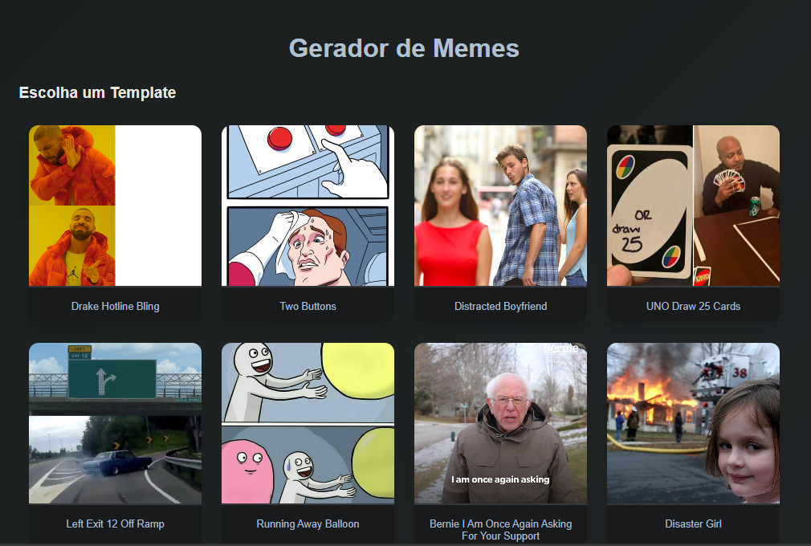
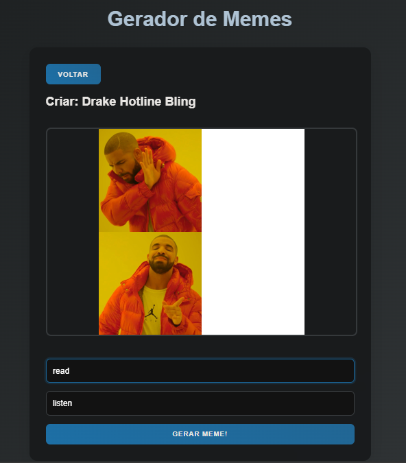
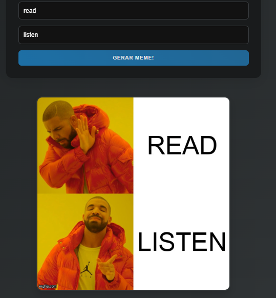

# Gerador de Memes com ImgFlip API

**Desenvolvido por:** [Carlos Henrique Lima do Nascimento]  


## 🎯 Descrição e Objetivo

Este projeto é um gerador de memes interativo que utiliza a **API pública do ImgFlip** para:
- Listar templates de memes populares via requisição `GET`
- Criar memes personalizados com textos via requisição `POST`
- Visualizar e compartilhar memes gerados

**API Utilizada:** [ImgFlip API](https://api.imgflip.com/)  
**Endpoints Principais:**
- `GET /get_memes` - Lista de templates
- `POST /caption_image` - Geração de memes

## 🛠 Tecnologias Utilizadas

- **React** (Framework Front-End)
- **Axios** (Cliente HTTP)
- **HTML5** (Estrutura Web)
- **CSS3** (Estilização)
- **JavaScript** (ES6+)
- **Git** (Controle de Versão)

## 📚 Funcionalidades

✅ Galeria de templates de memes    
✅ Pré-visualização em tempo real  
✅ Responsividade para dispositivos móveis  

## 🖼 Demonstração





## ⚙️ Como Executar
1. Crie uma conta gratuita no [ImgFlip](https://imgflip.com/) para obter username/password

2. Instale o [node.js](https://nodejs.org/)

3. Clone o repositório:
```bash
git clone https://github.com/Carlos-bub/ATV07API-REST.git
```
**4. instale as dependencias:**

Digite no terminal da sua IDE:
```bash
npm install
```
5. configure as variaveis ambiente no arquivo (.env):
```bash
REACT_APP_IMGFLIP_USER=seu_usuario
REACT_APP_IMGFLIP_PASS=sua_senha
```
6. Inicie o servidor: 

Digite no terminal da sua IDE: 
```bash
npm start
```

## 🖼 Referencias

- **[ImgFlip](https://imgflip.com/api)**
- **[React.js Meme Generator Tutorial](https://youtu.be/rtQKP1we-Dk?si=uaaCsAI87EEWd0_g)**
